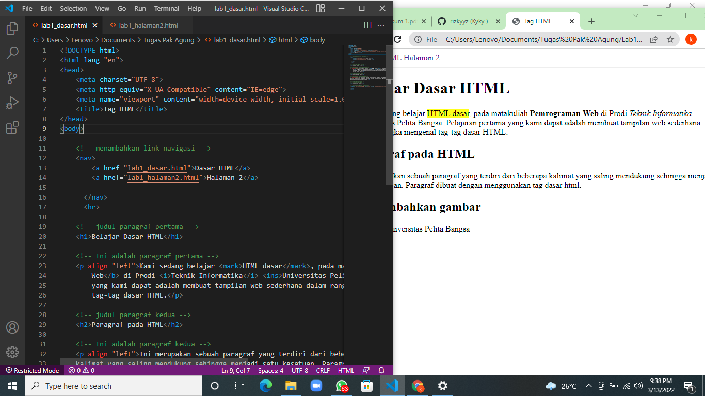
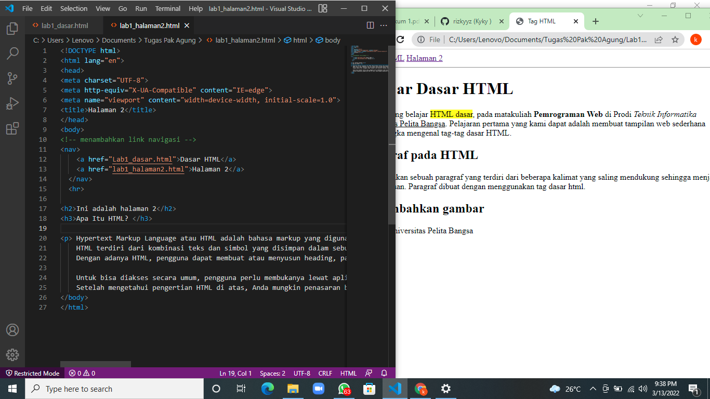

# Tugas LAB 1 Web
## Profil
| # | Biodata |
| -------- | --- |
| *Nama* | Muhammad Rizky Abdillah |
| *NIM* | 312010386 |
| *Kelas* | TI.20.A.2 |
| *Mata Kuliah* | Pemrograman Web |

## LANGKAH 1
* Buka VS Code dan buat file HTML baru. Setelah itu buat struktur dasar HTML

<!DOCTYPE html>
<html lang="en">
<head>
    <meta charset="UTF-8">
    <meta http-equiv="X-UA-Compatible" content="IE=edge">
    <meta name="viewport" content="width=device-width, initial-scale=1.0">
    <title>Tag HTML</title>
</head>
<body>
    
</body>
</html>

* Maka hasilnya akan seperti berikut.

## LANGKAH 2
* Membuat 2 buah paragraf dan atur atribut paragraf (Rata Kiri / Rata Kanan / Rata Tengah / Sama Rata)
html
<!-- Ini adalah paragraf pertama -->

Kami sedang belajar HTML dasar, pada matakuliah Pemrograman Web di Prodi Teknik Informatika Universitas Pelita Bangsa. Pelajaran pertama yang kami dapat adalah membuat tampilan web sederhana dalam rangka mengenal tag-tag dasar HTML.

<!-- Ini adalah paragraf kedua -->

Ini merupakan sebuah paragraf yang terdiri dari beberapa kalimat yang saling mendukung sehingga menjadi satu kesatuan. Paragraf dibuat dengan menggunakan tag dasar html.

* Maka hasilnya akan seperti berikut.

## Langkah 3
* Menambahkan judul menggunakan Tag Heading
html
<!-- judul paragraf pertama -->
<h1>Belajar Dasar HTML</h1>

<!-- judul paragraf kedua -->
<h2>Paragraf pada HTML</h2>

## Langkah 4
* Memformat Teks

| Tag | Fungsi |
| -------- | --- |
| `` | Menyisipkan sesuatu yang khusus, lalu atribut style menambahkan style pada sesuatu tersebut. |
| `<b>` | Membuat teks *bold* |
| `<i>` | Membuat teks italic |
| `<u>` | Membuat teks underline |

## Langkah 5
* Menyisipkan Gambar
html
<!-- sub judul paragraf -->
<h3>Menambahkan Gambar</h3>

<!-- menambahkan gambar pada dokumen -->

## Langkah 6
* Menambahkan hyperlink
html
<!-- menambahkan link navigasi -->
    <nav>
        <a href="lab1_dasar.html">Dasar HTML</a>
        <a href="lab1_halaman2.html">Halaman 2</a>
      </nav>
      

* Maka hasilnya akan seperti berikut.

* Kemudian kita membuat lab1_halaman2.html

<!DOCTYPE html>
<html lang="en">
<head>
<meta charset="UTF-8">
<meta http-equiv="X-UA-Compatible" content="IE=edge">
<meta name="viewport" content="width=device-width, initial-scale=1.0">
<title>Halaman 2</title>
</head>
<body>

<h2>Ini adalah halaman 2</h2>
<h3>Apa Itu HTML? </h3>

 Hypertext Markup Language atau HTML adalah bahasa markup yang digunakan untuk membuat struktur halaman website. 
    HTML terdiri dari kombinasi teks dan simbol yang disimpan dalam sebuah file. Dalam membuat file HTML, terdapat standar atau format khusus yang harus diikuti. Format tersebut telah tertuang dalam standar kode internasional atau ASCII (American Standard Code for Information Interchange). 
    Dengan adanya HTML, pengguna dapat membuat atau menyusun heading, paragraf, gambar, link, dan lainnya supaya dapat dilihat banyak orang melalui halaman website. 
</body>
</html>

* Maka hasilnya akan seperti berikut.

# Jawab Pertanyaan Berikut

1. Lakukan perubahan pada code sesuai dengan keinginan anda, amati perubahannya adakah error ketika terjadi kesalahan penulisan tag?
Tidak Ada

2. Apa perbedaan dari tag 
 dengan tag   berikan penjelasannya!
perbedaan  tag   jarak enter nya lebih jauh 1 line dibandingkan dengan tag 
 yg jarak enter nya tidak terlalu jauh.

3. Apa perbedaan atribut title dan alt pada tag , berikan penjelasannya!
atribut tittle pada tag  digunakan untuk memberi judul pada gambar yg disisipkan, sedangkan
atribut alt pada tag  digunakan untuk memberi deskripsi pada gambar yg disisipkan

4. Untuk mengatur ukuran gambar, digunakan atribut width dan height. Agar tampilan gambar proporsional sebaiknya kedua atribut tersebut diisi semua atau tidak? Berikan penjelasannya!
Untuk mempertahankan proporsi gambar, namun tetap membuat gambar menjadi besar/kecil, cantumkan
hanya salah satu atribut saja (width saja atau height saja, namun tidak keduanya). Misalkan
jika kita menetapkan atribut width=200px (tanpa mencantumkan height), maka web browser akan
menampilkan gambar dengan lebar 200px, dan menghitung secara otomatis tinggi gambar agar gambar
tetap proporsional.

5. Pada link tambahkan atribut target dengan nilai atribut bervariasi (_blank, _self, _top, _parent), apa yang terjadi pada masing-masing nilai antribut tersebut?
Nilai _blank akan membuka link/halaman di tab baru.
Nilai _self akan membuka link/halaman di tab saat ini.
Nilai _top membuka link/halaman dan membatalkan semua frame.
Nilai _parent membuka link/halaman pada parent frame.
